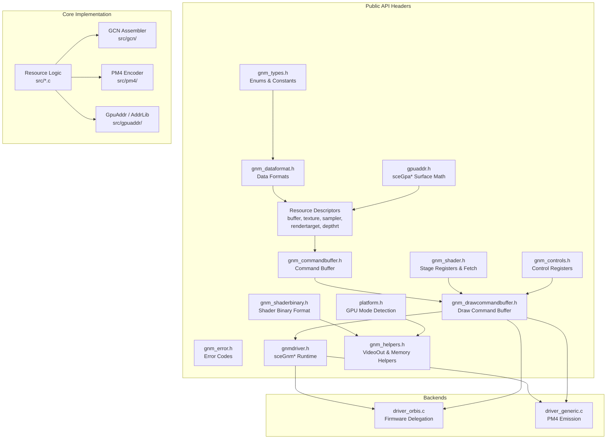
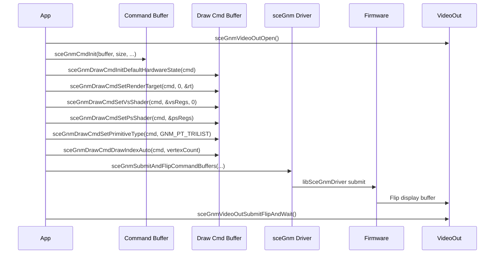
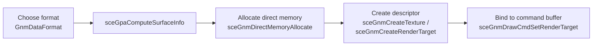

# Architecture

opengnm is structured as a layered library with a shared core and two
platform-specific backends. This page describes the subsystems, data flow, and
design principles.

---

## Subsystem Overview



## Design Principles

### 1. ABI Compatibility First

Every public struct uses `_Static_assert` to verify its binary size matches the
Sony SDK layout. This ensures that code compiled against the official SDK
headers produces identical binary descriptors.

```c
_Static_assert(sizeof(GnmTexture) == 0x20, "");
_Static_assert(sizeof(GnmRenderTarget) == 0x40, "");
_Static_assert(sizeof(GnmCommandBuffer) == 0x40, "");
```

### 2. Header-Only Where Possible

Many accessor functions are `static inline` in the headers, meaning they
generate no library symbols and can be used without linking against opengnm.
This includes texture, buffer, render target, and depth render target getters
and setters.

### 3. Two Backends, One API

The same `sceGnm*` function signatures are implemented differently depending on
the selected backend:

| Aspect | Orbis Backend | Generic Backend |
|--------|--------------|-----------------|
| File | `src/driver_orbis.c` | `src/driver_generic.c` |
| Target | PS4 hardware | Host (macOS/Linux/Windows) |
| Submit | Forwards to `libSceGnmDriver` firmware | No-op / PM4 buffer capture |
| Draw commands | Firmware packet building | Direct PM4 emission |
| Use case | Production PS4 apps | Testing, development, CI |

See [Backends](backends.md) for details.

### 4. Source-Level freegnm Compatibility

The `<compat/freegnm.h>` header provides `#define` aliases that map old `gnm*`
wrapper names to `sceGnm*` ABI symbols. This is source-only — no second set of
exported symbols is created. Existing freegnm consumers can switch to opengnm
by changing their include path.

---

## Data Flow

### Typical Rendering Frame



### Surface Setup Flow



---

## Source Layout

```
opengnm/
├── include/                # Public API headers
│   ├── gnm.h              # Master include
│   ├── gnm_types.h        # Enums, constants, limits
│   ├── gnm_error.h        # Error codes
│   ├── gnm_dataformat.h   # Data formats
│   ├── gnm_buffer.h       # Buffer descriptor
│   ├── gnm_texture.h      # Texture descriptor
│   ├── gnm_sampler.h      # Sampler descriptor
│   ├── gnm_rendertarget.h # Render target descriptor
│   ├── gnm_depthrendertarget.h
│   ├── gnm_controls.h     # Control register structs
│   ├── gnm_shader.h       # Shader stage registers
│   ├── gnm_shaderbinary.h # Shader binary format
│   ├── gnm_commandbuffer.h
│   ├── gnm_drawcommandbuffer.h
│   ├── gnmdriver.h        # sceGnm* runtime (207+ functions)
│   ├── gpuaddr.h          # sceGpa* surface computation
│   ├── platform.h         # GPU mode detection
│   ├── gnm_helpers.h      # VideoOut, memory, validation
│   ├── gnm_strings.h      # Enum string converters
│   ├── compat/freegnm.h   # freegnm source compatibility
│   └── gnm/               # Forwarding headers for compat
├── src/                    # Implementation
│   ├── *.c                # Core resource logic
│   ├── driver_orbis.c     # Orbis backend
│   ├── driver_generic.c   # Generic backend
│   ├── platform_orbis.c
│   ├── platform_generic.c
│   ├── gcn/               # GCN assembler (fetch shaders)
│   ├── pm4/               # PM4 packet encoder
│   ├── gpuaddr/           # AddrLib surface computation
│   └── u/                 # Internal utilities
├── tests/                  # Test suite (54+ tests)
├── CMakeLists.txt          # CMake build
├── Makefile                # Make build
└── config.{generic,orbis}.mak
```

---

## Key Constants

| Constant | Value | Description |
|----------|-------|-------------|
| `GNM_NUM_SHADER_STAGES` | 8 | Number of shader stages |
| `GNM_MAX_RENDERTARGETS` | 8 | Maximum simultaneous render targets |
| `GNM_MAX_VIEWPORTS` | 16 | Maximum simultaneous viewports |
| `GNM_MAX_TSHARP_USERDATA_SLOTS` | 8 | Max texture user data slots |
| `GNM_MAX_SSHARP_USERDATA_SLOTS` | 12 | Max sampler user data slots |
| `GNM_MAX_VSHARP_USERDATA_SLOTS` | 12 | Max buffer user data slots |
| `GNM_MAX_POINTER_USERDATA_SLOTS` | 14 | Max pointer user data slots |
| `GNM_ALIGNMENT_SHADER_BYTES` | 256 | Shader code alignment |
| `GNM_ALIGNMENT_BUFFER_BYTES` | 4 | Buffer base address alignment |
| `GNM_INDIRECT_BUFFER_MAX_BYTESIZE` | 0x3FFFFC | Max indirect buffer size |
